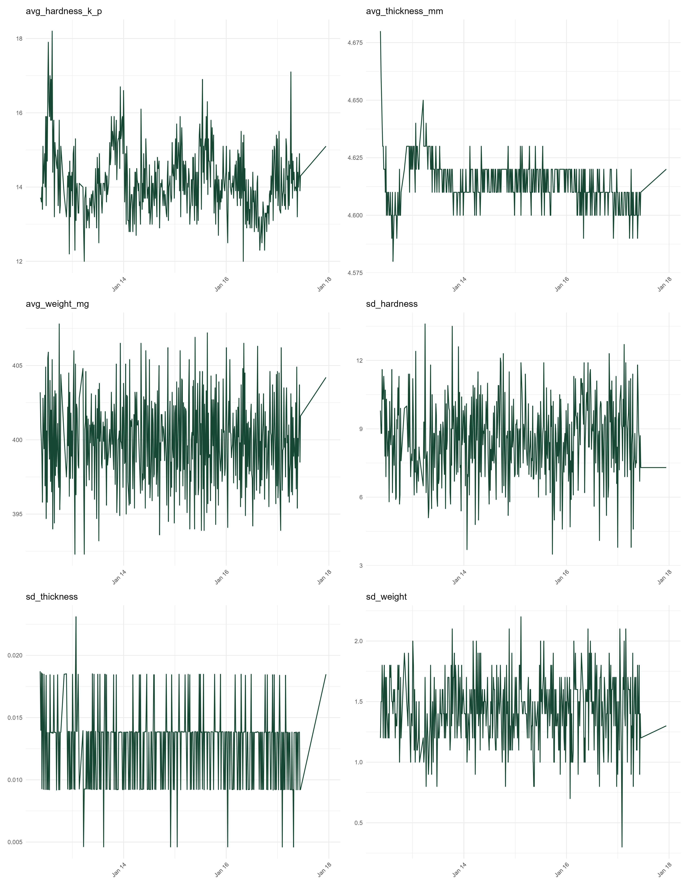
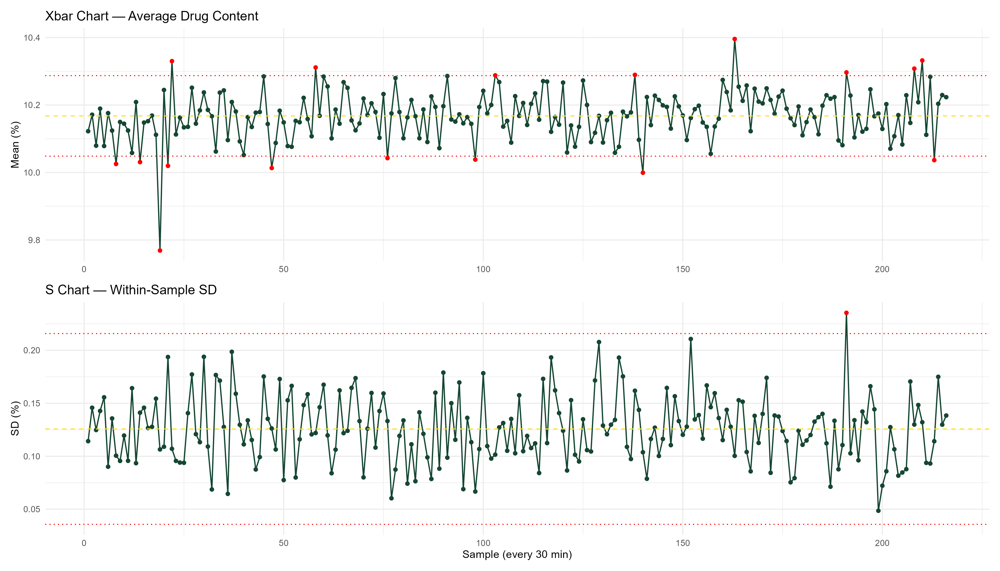

```{r}
#| include: false
knitr:: opts_chunk$set(echo = FALSE, message = FALSE, warning = FALSE)
library(tidyverse)
library(lubridate)
library(patchwork)
library(knitr)
library(kableExtra)

# Loading Data

```

# MSOM Challenge Data Set Analysis

## Overview:

The **GEA CDC-50 Rig** was constructed by integrating three units into a single processing platform. This was done by combining the **GEA LiW Feeding System** with **ConsiGma Dosing and Blending (DB) Modules** as well as the **Nexgen Press Range**.


```{html}
<div style="display:flex; flex-wrap:wrap; gap:12px; align-items:center; font-family:Arial;">
  
  <div style="padding:12px 14px; border-radius:12px; background:#e8f1ff; border:2px solid #2f6fed; min-width:220px;">
    <b>1) Raw Material Feeding</b><br>
    <span style="opacity:.85;">Loss-in-Weight (LiW) Feeders</span>
  </div>

  <div style="font-size:26px; opacity:.55;">→</div>

  <div style="padding:12px 14px; border-radius:12px; background:#e9fbe9; border:2px solid #2aa44f; min-width:220px;">
    <b>2) Initial Blending</b><br>
    <span style="opacity:.85;">Blender 1</span>
  </div>

  <div style="font-size:26px; opacity:.55;">→</div>

  <div style="padding:12px 14px; border-radius:12px; background:#fff6db; border:2px solid #d6a100; min-width:260px;">
    <b>3) Lubricant + Final Blending</b><br>
    <span style="opacity:.85;">Lubricant Addition → Blender 2</span>
  </div>

  <div style="font-size:26px; opacity:.55;">→</div>

  <div style="padding:12px 14px; border-radius:12px; background:#ffe8e8; border:2px solid #d84a4a; min-width:220px;">
    <b>4) Compression</b><br>
    <span style="opacity:.85;">Nexgen Tablet Press</span>
  </div>

  <div style="font-size:26px; opacity:.55;">→</div>

  <div style="padding:12px 14px; border-radius:12px; background:#f1e9ff; border:2px solid #7a4dd8; min-width:240px;">
    <b>5) In-Process QC</b><br>
    <span style="opacity:.85;">Weight • Hardness • CU</span>
  </div>

  <div style="font-size:26px; opacity:.55;">→</div>

  <div style="padding:12px 14px; border-radius:12px; background:#fff0e1; border:2px solid #e07a1f; min-width:220px;">
    <b>6) Final Coating</b><br>
    <span style="opacity:.85;">Coating Stage</span>
  </div>

</div>
```

This specific data set consists of 10 worksheets of data collected from a 120 hour study in which **Machine Level & Contextual Quality** data was collected to **asses the effects of raw material changes** during the study.

-   Production data was collected by **GEA**

-   Data can be used to generate insights that support research focused on the use of **Continuous Manufacturing** and **Real-Time-Release-Testing i**n the **Pharmaceutical** and **Bio-Pharmaceutical Industries**.

## Raw Data/Materials:

**The raw data is provided in .csv and .xlsx files.**

-   **Machine Data:** Inline Process Parameters

    -   LiW Feeders 1.csv

    -   LiW Feeders 2.csv

    -   Blenders.csv

    -   Tablet Press.csv

    -   Humidity.csv

    -   Temperature.csv

-   **Contextual Quality Data:** Raw Materials, Tablet Specifications, and Content Uniformity

    -   RM Tablet Properties and Drum Change.xlsx

    -   RM Content Uniformity.xlsx

    -   RM Material Properties.xlsx

    -   Logbook Long Run Days.xlsx

-   **Materials Used in the Study:**

    -   Active Pharmaceutical Ingredient (API): **Acetaminophen**

    -   Diluents: **Microcrystalline Ceullulose** & **Anhydrous Dicalcium Phosphate**

    -   Disintegrants: **Crosarmellose Sodium**

    -   Lubricants: **Magnesium Stearate** & **Sodium Stearyl Fumarate**

-   **LiW Feeder Material Configuration:**

```         
-   LiW Feeder 1 & 4: Microcrystalline Cellulose

-   LiW Feeder 2: Spray-Dried Lactose

-   LiW Feeder 3: Acetaminophen

-   LiW Feeder 5: Sodium Croscarmellose

-   LiW Feeder 7: Magnesium Stearate
```

## Key Technologies & Process Analytic Tools

-   **Continuous Manufacturing**

-   **Real-Time Release Testing**

-   **Residence Time Distribution**

## Machine Data

### Loss-in-Weight Feeders:

The **GEA Unit 50 Rig** utilizes five **Loss-in-Weight Feeders** (PD1–PD5) to deliver individual powder components into the first continuous blender. Each Loss-in-Weight Feeder Control System dynamically adjusts operating parameters, such as screw speed, to correct deviations from desired flow rates and maintain consistent feeding.

The Key Process Parameters associated with the **Loss-in-Weight Feeder** serve as primary indicators of process control that are used to classify and characterize **Interruption Events** are:

-   **Screw RPM** : LiW Feeder Screw Speed, measured in Rotations per Minute

-   **Massflow PD:** Mass flow Rate, measured in Kilogram/Hour

*Each Parameter Associated w/ LiW Feeder (e.g. Screw RPM PD1, Screw RPM PD2, etc....)*

Below is a summary of all the **Loss-in-Weight** **Inline Process Parameters**

*Summary Statistics of All Inline Process Parameters by Status (Running or Interrupted)*

*Summary of LiW Feeders Interruption Events Durations*

```{r}
#| echo: false
library(DT)
library(dplyr)
library(tidyverse)
feeders_full_summary = readRDS(file.path(getwd(),"Cleaned Data& Code","Summary Data", "feeders_full_summary.rds"))
datatable(feeders_full_summary %>%
            mutate(across(where(is.numeric), ~round(., 2))),
          caption = "LiW Feeder Full Summary", options = list(pageLength = 10, scrollX = TRUE), rownames = FALSE)

feeder_interruptions_summary = readRDS(file.path(getwd(),"Cleaned Data& Code","Summary Data", "feeder_interruptions_summary.rds"))
datatable(feeder_interruptions_summary %>%
            mutate(across(where(is.numeric), ~round(., 2))),
          caption = "LiW Feeders Interruption Duration Summary Statistics", options = list(pageLength = 10, scrollX = TRUE), rownames = FALSE)
```

::: panel-tabset
# Loss-in-Weight Feeder Interruption Event Study

## 15 Secs

```{r}
#| echo: false

htmltools::tags$iframe(
  src    = "Feeder_Event_Studies(15 Secs).pdf",
  width  = "100%",
  height = "800px",
  style  = "border: none;"
)
```

## 30 Secs

```{r}
#| echo: false

htmltools::tags$iframe(
  src    = "Feeder_Event_Studies(30 Secs).pdf",
  width  = "100%",
  height = "800px",
  style  = "border: none;"
)
```

## 1 Min

```{r}
#| echo: false

htmltools::tags$iframe(
  src    = "Feeder_Event_Studies(1 Min).pdf",
  width  = "100%",
  height = "800px",
  style  = "border: none;"
)
```

## 1.5 Mins

```{r}
#| echo: false

htmltools::tags$iframe(
  src    = "Feeder_Event_Studies(1.5).pdf",
  width  = "100%",
  height = "800px",
  style  = "border: none;"
)
```

2 Mins

```{r}
#| echo: false

htmltools::tags$iframe(
  src    = "Feeder_Event_Studies.pdf",
  width  = "100%",
  height = "800px",
  style  = "border: none;"
)
```
:::

### Continuous Blenders:

Blender 1 is where powders are combined and mixed under continuous operation. This blender provides sufficient residence time and shear to produce a homogeneous intermediate blend.

The output of Blender 1 feeds directly into Blender 2, where the final blend is prepared.

The Key Process Parameters associated with the **Continuous Blenders** that serve as primary indicators of process control that are used to classify and characterize **Interruption Events** are:

-   **Massflow Blender 1:** Mass flow Rate, measured in Kilogram/Hour

-   **Massflow Blender 2:** Mass flow Rate, measured in Kilogram/Hour

-   **OOS Concentration at Blender 1:** Fraction of Blend Containing Material that has Been Subject to Out of Specification Warning

-   **OOS Concentration at Blender 2:** Fraction of Blend Containing Material that has Been Subject to Out of Specification Warning

Below are two tables summarizing the **Continuous** **Inline Process Parameters**

*Summary Statistics of All Inline Process Parameters by Status (Running or Interrupted)*

*Summary of Continuous Blender Interruption Events Durations*

```{r}
#| echo: false
library(DT)
library(dplyr)
library(tidyverse)

blenders_full_summary = readRDS(file.path(getwd(),"Cleaned Data& Code","Summary Data", "blenders_full_summary.rds"))
datatable(blenders_full_summary %>%
            mutate(across(where(is.numeric), ~round(., 2))),
          caption = "Continuous Blender Full Summary", options = list(pageLength = 10, scrollX = TRUE), rownames = FALSE)
blenders_interruptions_summary = readRDS(file.path(getwd(),"Cleaned Data& Code","Summary Data", "blenders_interruptions_summary.rds"))
datatable(blenders_interruptions_summary %>%
            mutate(across(where(is.numeric), ~round(., 2))),
          caption = "Continuous Blender Interruption Duration Summary Statistics", options = list(pageLength = 10, scrollX = TRUE), rownames = FALSE)
```

::: panel-tabset
# Continuous Blender Interruption Event Study

## 15 Sec

```{r}
#| echo: false

htmltools::tags$iframe(
  src    = "Blender_Event_Studies(15 Secs).pdf",
  width  = "100%",
  height = "800px",
  style  = "border: none;"
)
```

## 30 Sec

```{r}
#| echo: false

htmltools::tags$iframe(
  src    = "Blender_Event_Studies(30 Secs).pdf",
  width  = "100%",
  height = "800px",
  style  = "border: none;"
)
```

## 1 Min

```{r}
#| echo: false

htmltools::tags$iframe(
  src    = "Blender_Event_Studies(1 Min).pdf",
  width  = "100%",
  height = "800px",
  style  = "border: none;"
)
```

## 1.5 Mins

```{r}
#| echo: false

htmltools::tags$iframe(
  src    = "Blender_Event_Studies(1.5 Mins).pdf",
  width  = "100%",
  height = "800px",
  style  = "border: none;"
)
```

## 2 Mins

```{r}
#| echo: false

htmltools::tags$iframe(
  src    = "Blender_Event_Studies(2 Mins).pdf",
  width  = "100%",
  height = "800px",
  style  = "border: none;"
)
```
:::

### Tablet Press:

The final powder blend exits Blender 2 and is transferred to a rotary tablet press, where it is compacted into tablets. Tablet formation occurs in two main stages:

-   ***Pre-compression***: during which the powder is lightly compacted as the bottom punch moves upward while the upper punch remains fixed.
-   ***Main compression:*** where higher compression forces are applied to form tablets with the desired weight, thickness, and mechanical strength.

*Tablet press control systems adjust parameters such as compression force and die fill depth to ensure consistent tablet quality.*

The Key Process Parameters associated with the Tablet Press that serve as primary indicators of process control and are used to classify and characterize Interruption Events are:

-   **Filing Shoe M20M Speed:** Feeder Paddle 1 Speed, Rotations Per Minute

Below are two tables summarizing the **Tablet Press** **Inline Process Parameters**

*Summary Statistics of All Inline Process Parameters by Status (Running or Interrupted)*

*Summary of Tablet Press Interruption Events Durations*

```{r}
#| echo: false
library(DT)
library(dplyr)
library(tidyverse)

press_full_summary = readRDS(file.path(getwd(),"Cleaned Data& Code","Summary Data", "press_full_summary.rds"))
datatable(press_full_summary %>%
            mutate(across(where(is.numeric), ~round(., 2))),
          caption = "Tablet Press Full Summary", options = list(pageLength = 10, scrollX = TRUE), rownames = FALSE)

press_interruptions_summary = readRDS(file.path(getwd(),"Cleaned Data& Code","Summary Data", "press_interruptions_summary.rds"))
datatable(press_interruptions_summary %>%
            mutate(across(where(is.numeric), ~round(., 2))),
          caption = "Tablet Press Interruption Duration Summary Statistics", options = list(pageLength = 10, scrollX = TRUE), rownames = FALSE)
```

::: panel-tabset
# Tablet Press Interruption Event Study

## 15 Secs

```{r}
#| echo: false

htmltools::tags$iframe(
  src    = "Tablet_Press_Event_Studies(15 Secs).pdf",
  width  = "100%",
  height = "800px",
  style  = "border: none;"
)
```

## 30 Secs

```{r}
#| echo: false

htmltools::tags$iframe(
  src    = "Tablet_Press_Event_Studies(30 Secs).pdf",
  width  = "100%",
  height = "800px",
  style  = "border: none;"
)
```

## 1 Min

```{r}
#| echo: false

htmltools::tags$iframe(
  src    = "Tablet_Press_Event_Studies(1 Min).pdf",
  width  = "100%",
  height = "800px",
  style  = "border: none;"
)
```

## 1.5 Mins

```{r}
#| echo: false

htmltools::tags$iframe(
  src    = "Tablet_Press_Event_Studies(1.5 Min).pdf",
  width  = "100%",
  height = "800px",
  style  = "border: none;"
)
```

## 2 Mins

```{r}
#| echo: false

htmltools::tags$iframe(
  src    = "Tablet_Press_Event_Studies(2 Min).pdf",
  width  = "100%",
  height = "800px",
  style  = "border: none;"
)
```
:::

# Contextual Quality Data

## Tablet Quality

```{r}

#| echo: false
library(DT)
library(dplyr)
library(tidyverse)
tablet_quality_summary = readRDS(file.path(getwd(),"Cleaned Data& Code","Summary Data", "tablet_quality_summary.rds"))
datatable(tablet_quality_summary%>%
            mutate(across(where(is.numeric), ~round(., 2))),
          caption = "Tablet Quality Summary Statistics", options = list(pageLength = 10, scrollX = TRUE), rownames = FALSE)

```



## Content Uniformity (Drug Content %)


